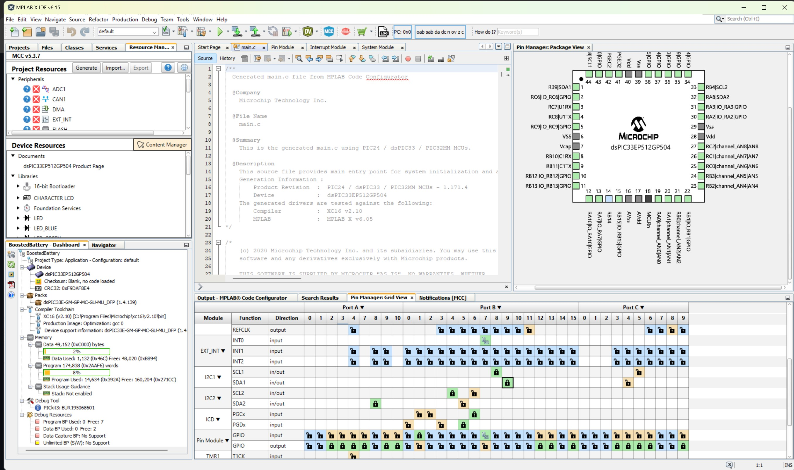

# BoostedUnbrickFirmware
Custom dsPIC33 firmware for the Boosted Extended Range (XR) Battery to emulate necessary functions for operating the skateboard.

## Disclaimer
Lithium batteries can be very dangerous if improperly handled. I am providing the results of my experiments AS-IS. There may be issues still with it operating, use this at your own risk. I take no responsibility for any damages caused by using this firmware on your board. Using this firmware will erase the normal boosted firmware on your MCU, this is not reversible.

## Introduction
### Background
About two years ago, my brother had picked up a Boosted Mini X off of Craigslist for ~$100. The board had the infamous Red-Light-Of-Death (RLOD), which is usually caused by the lithium cells becoming unbalanced. RLOD is a firmware lockout of the battery's operation and is permanent unless you get it repaired by Boosted. Nonetheless, with Boosted now out of business, and second-hand batteries becoming expensive on eBay and other sites, I wanted to see if I could revive the battery I already had. 

### Adventure 1: Noninvasive Repairs - Clearing RLOD
I managed to get the pack cracked open and measured each of the cells. As expected, a few of the cells were quite low from years of sitting in the previous owner's shed. I manually balanced the cells using a bench power supply, but the RLOD persisted, even though the cells were within 50mV of each other. I then found [jonataubert's RLOD B2XR guide](https://github.com/jonataubert/RLOD_B2XR), which notes that the RLOD is stored in an onboard SPI flash. I followed the instructions for resetting the data in the battery's onboard flash memory using Flashrom on a Raspberry Pi. This did manage to be successful once, but the RLOD showed up again after some time. Having some busy final semesters in college, I ended up shelving the project with the debug wires still attached to the delicate SPI flash. At some point, I accidentally bumped one of the 3.3V data lines into the 50V main battery terminal... and poof goes the magic smoke (as my college embedded systems professor called it). The overvolted data line caused the attached SPI flash and the main dsPIC33 MCU to have their lines overvolted and rendered unusable—no more simple flash modification for me.

### Adventure 2: Shooting in the Dark - Boosted SRB Firmware Emulation on a PIC
With the magic fuzzies let out of my dsPIC33 and ISLP25 SPI Flash, I was out of options for just fixing the RLOD data. The only option would be to control the hardware on the board using another MCU. Initially, I thought about making my own PCB with an Arduino, but I researched the PIC chip and found that Microchip has an easy-to-use development environment (MPLAB X IDE). The MCU that Boosted used in the XRB is the dsPIC33EP512GP504 and goes for about $5 on [DigiKey](https://www.digikey.com/en/products/detail/microchip-technology/DSPIC33EP512GP504-I-PT/3879834), so I figured I'd try my luck in programming one of those. With the fried MCU desoldered from the battery PCB, I was able to use a multimeter to figure out where the pins routed to and an overall circuit diagram for how the MCU is hooked up. Now that the beep-beep of continuity mode on the multimeter was out of the way, I used MPLAB X and the MCC to configure the pins in the software to match the PCB pads. Some more days and cups of coffee later, I was able to talk to the Battery Management System (BMS) IC over I2C and control charging and discharging. However, I found the Electronic Speed Controller (ESC) requires CAN Bus data from the battery to enable operation. Thankfully, I stumbled across [rscullin's](https://github.com/rscullin) [BeamBreak](https://github.com/rscullin/beambreak) guide which had a Python script for emulating the basic CAN Bus packets the standard range battery (SRB). I managed to get that converted to use the CAN peripheral on the PIC and added that to the BMS. Profit. Now the motors were able to do some simple spin tests. Emulation of the SRB and basic battery management made for a nice joyride on the now partially functional board.

### Adventure 3: Tuning All the Knobs - Boosted XRB Firmware Emulation on a PIC
With a somewhat rideable board under my feet, I wanted to get everything tuned nicely to behave like the old battery did. Unfortunately, this meant more digging in the dark to figure out how to emulate the XRB CAN Bus. Fortunately, one of my peers from college happened to have a functional Boosted Mini X with an XRB. He graciously agreed to let me borrow it for some ~~evil scheming~~ *productive analysis of the XRB CAN Frames*. I used my DIY CAN Bus reader to sit on the CAN Bus line and print out all of the messages going between his functional XRB and my ESC (which had tap wires soldered to it). I got a nice dump of frames to sort through and understand. I stumbled across yet another great project, the [BoostedBreak](https://github.com/axkrysl47/BoostedBreak) project by [axkrysl47](https://github.com/axkrysl47), which had interpretation for the frames the XRB and ESC were sending to each other. After a few iterations and tuning the timing, the custom firmware for the dsPIC33 was emulating the XRB frames close enough to have the ESC not signal an error (cause the remote to wail at the top of its lungs). It's still a work in progress, but this firmware should be able to replace the original XRB firmware and allow a once-RLOD'd board to work once again. I still have some features of the XRB that need to be implemented, such as the button press codes and the remote poweroff, but it's brought life back to this board that's been collecting dust. I have some more of the technical details to come in the [Deep Dive](#deep-dive) section of the README in a future release.

## A Huge Thanks To
- [rscullin](https://github.com/rscullin) and the [BeamBreak](https://github.com/rscullin/beambreak) project, which helped get initial SRB emulation working.
- [axkrysl47](https://github.com/axkrysl47) and the [BoostedBreak](https://github.com/axkrysl47/BoostedBreak) project which helped in interpreting the CAN Bus frames sent between the battery and ESC.
- [jonataubert](https://github.com/jonataubert) and the [RLOD B2XR](https://github.com/jonataubert/RLOD_B2XR) project which helped in understanding the symptoms of RLOD.
- [r/Lambertofmtl](https://www.reddit.com/r/boostedboards/comments/ghdyi7/bb_v2_xr_bms_pcb_analysis/) and the [B2XR PCB Analysis](https://www.reddit.com/r/boostedboards/comments/ghdyi7/bb_v2_xr_bms_pcb_analysis/) Reddit post which helped in finding datasheets for the hardware.

## Tools Used for this Project
- MPLAB X IDE with xc16 Compiler
- PICKit3 In-circuit Debugger
- Lots of patience

## Custom Firmware Features
### Normal Boosted XRB Functions
- State of Charge (SoC) reading on XRB and remote
- Cell balancing
- Overvoltage/Undervoltage protection
- CAN Bus communication for ESC operation

### Custom Features
- Min/Max cell delta on 5-segment display when charging
- Limp mode (temporarily lowers minimum cell voltage)

## To-Do
- Automatic power off via remote
- BMS automatic re-enable after charge completion (must be power cycled before riding)
- Button press CAN Bus functionality (button only turns on/off right now)

## Not functional
- Reading the SPI flash
- Many things stored by the memory (I'm not sure what's stored here as my memory chip let out magic smoke)

## Deep Dive
Here lie the tales of exploring the B2XR hardware and software to get the Boosted Mini X ESC working 

### Starting Out
As mentioned in the [Introduction Section](#deep-dive) of the repository, I first started out trying to clear the RLOD error using [jonataubert's RLOD B2XR guide](https://github.com/jonataubert/RLOD_B2XR). This was after manually balancing the cells using a bench supply to get each cell within 50mV of the others. I didn't want to purchase the TC2030-IDC connector, so I soldered on a series of 28AWG solid core wires and fed those into a breadboard I had in a drawer. I didn't have an FT232-H adapter at the time to connect to the SPI flash onboard, so I connected up a Raspberry Pi to the memory. After loading up a fresh copy of Raspbian on the Pi, I got flashrom installed and attempted to connect to the flash. Following Johnathan's method, I cleared the RLOD and the board into a rideable state. My makeshift setup below:

However, the board entered an RLOD state a few rides later, the cells seemed to be unhealthy from so many years in the previous owner's shed. Balanced the cells and cleared RLOD again. Rode a few more times, and had the same issue. Fast forward a few months after some hard college semesters, and I was trying to repair the battery again - only this time I accidentally had a SPI data wire touch the 50V battery. The smell of burnt silicon is no stranger to me after a few years of experimenting with electronics. However, at this point, I had a Computer Engineering degree under my belt. I figured I would try to get the still-good speed controller functional using another microcontroller. 

### Initial ideas for getting ESC Working
- **Custom Battery PCB**: Design a battery PCB with a simple BMS (like those on basic ESkate boards) that would just connect to the input, output, and balance wires. This would not require advanced components but would require a PCB design and may not fit in the original battery box.
- **External MCU on Boosted PCB**: Take and attach wires to the pads where the fried MCU used to live and write simple software to do emulation. This would require reverse-engineering the schematic of the Boosted PCB and hoping the external MCU would fit in the original battery box.
- **Custom Smart Battery PCB**: Design a smart battery controller like Boosted's using an Arduino or [Particle](https://www.particle.io/) based microcontroller. This would require a lot of work in developing a BMS and sourcing new components (some of which are rare, like the balance connector).
- **Custom Firmware for dsPIC**: Replace the fried dsPIC MCU and write software that would emulate Boosted firmware. This would require reverse-engineering the schematic of the Boosted PCB and a lot of exploration into an embedded platform I've not used before. Plus side would be easy replicability across more B2XR batteries.

I chose the last option as I wanted to refresh some of my embedded software skills, and a lot of my other projects live in Arduino-land, where abstraction and ease of use are plentiful. Time for a good challenge. Fire up the coffee machine!

### Doing My Homework on the dsPIC
Doing some quick digging on writing software for the PIC, I stumbled across this [guide for programming the dsPIC33](https://predictabledesigns.com/the-beginners-guide-to-designing-with-the-dspic33-microcontroller/) which had some very useful information about the MPLAB X IDE and the necessary In-Circuit Debugger (ICD) for programming. 

#### Code Environment
For basic development, MPLAB X IDE is free to use and can be found [here](https://www.microchip.com/en-us/tools-resources/develop/mplab-x-ide). As mentioned in the Predictable Designs article, I also need a compiler to use in MPLAB. This is where Microchip can upcharge-better compilers with better optimization = more money (who would've guessed?). However, they have a free compiler, [XC16](https://www.microchip.com/en-us/tools-resources/develop/mplab-xc-compilers), which would be perfectly fine for the basic emulation I am trying to do.

#### PICKit3 In-Circuit Debugger
The Predictable Designs article also discussed the various options for debuggers for the PIC series of microcontrollers. The dsPIC33EP is not the latest and greatest, so I was able to get away with the older and MUCH cheaper PICKit3. I managed to get my hands on one for $25 on eBay, which was a steal compared to the $100+ PICKit4. Debugger secured.

#### MPLAB Code Configurator
The last thing the Predictable Designs article discussed was the MPLAB Code Configurator (MCC), which is a super useful tool to configure the hardware using a GUI. Having no prior experience with PIC chips, I was pleasantly surprised by the (mostly) useable interface. After selecting the chip memory configuration I had (dsPIC33EP512GP504), it showed me all of the various functions of the pins available on my package. After locking in a pin function and pressing the convenient "Generate" button, MCC automatically generated several files with Hardware Abstraction Layer (HAL) functions. For those not too familiar with embedded-level terminology, this abstracts the 1's and 0's of turning on and off pins and handling communication with convenient functions like RA1_SetHigh() (a function to set pin RA1 to a value of high) and I2C1_Initialize() which initializes the I2C1 interface and configures the speed based on values I set in the GUI.

### Observing the Hardware

I first started by desoldering the old fried MCU to see what the PCB looked like underneath it:

Thankfully, Boosted used a two-layer board (from what I can tell), making it easy to follow traces around the board. I cracked out my trusty multimeter and started following traces and buzzing around to see where the MCU pins went. With the complexity of the board and some of the ICs on it, I decided to break down the exploration into some of the subsystems on the board - those I have listed below:

#### TLC59108 I2C LED Driver: Make it Blink!

The first connection I found on the board was to the TLC59018 LED driver. This chip is controlled over [I2C](https://www.circuitbasics.com/basics-of-the-i2c-communication-protocol/) and allows for control of up to 8 LEDs - perfect for the Boosted setup with the 5-segment display plus the RGB LED for the button. I didn't want to solder on a new PIC chip yet as I was still working through the other pin connections, but I wanted to test out the LED controller to see if the PCB had any life left after the 50V zap to the PIC. I grabbed a spare Arduino Mega 2560 out of a drawer and found [chrylis's TLC59108 Arduino Library](https://github.com/chrylis/tlc59108). I soldered on some wires to the I2C lines and the reset pin (forgot that at first - nearly drove me crazy) and attached those to the Arduino's I2C lines. With a basic for loop on each of the 8 channels, I got basic functionality out of the LED controller. Hello, World. 

#### BQ76940 I2C Cell Monitor: Battery Protection Made Easy (Sort of).

[LibreSolar BQ76940 Arduino Library](https://github.com/LibreSolar/bq769x0-arduino-library)

#### BQ7620B Charge/Discharge Driver: A Helping Hand.

#### Power Latch

### Wiring Diagrams (From an MCU's Perspective)

#### MCU Connections

#### Overall Wiring

### Putting the Magic Fuzzies Back (Part 1): Soldering on a New PIC

### Putting the Magic Fuzzies Back (Part 2): ~~Coding~~ Software Engineering

### SRB CAN Bus Emulation

### XRB CAN Bus Emulation

### Icing on the Cake: Cell Balance Display

