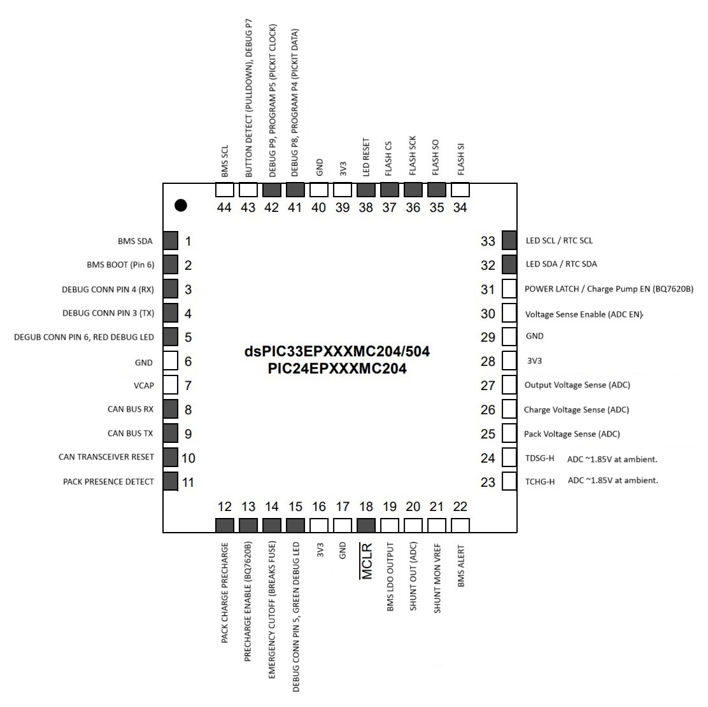

# BoostedUnbrickFirmware
Custom dsPIC33 firmware for the Boosted Extended Range (XR) Battery to emulate necessary functions for operating the skateboard.


## Disclaimer
Lithium batteries can be very dangerous if improperly handled. I am providing the results of my experiments AS-IS. There may be issues still with it operating, use this at your own risk. I take no responsibility for any damages caused by using this firmware on your board. Using this firmware will erase the normal boosted firmware on your MCU, this is not reversible.

## Introduction
### Background
About two years ago, my brother had picked up a Boosted Mini X off of Craigslist for ~$100. The board had the infamous Red-Light-Of-Death (RLOD), which is usually caused by the lithium cells becoming unbalanced. RLOD is a firmware lockout of the battery's operation and is permanent unless you get it repaired by Boosted. Nonetheless, with Boosted now out of business, and second-hand batteries becoming expensive on eBay and other sites, I wanted to see if I could revive the battery I already had. 

### Adventure 1: Noninvasive Repairs - Clearing RLOD
I managed to get the pack cracked open and measured each of the cells. As expected, a few of the cells were quite low from years of sitting in the previous owner's shed. I manually balanced the cells using a bench power supply, but the RLOD persisted, even though the cells were within 50mV of each other. I then found [jonataubert's RLOD B2XR guide](https://github.com/jonataubert/RLOD_B2XR), which notes that the RLOD is stored in an onboard SPI flash. I followed the instructions for resetting the data in the battery's onboard flash memory using Flashrom on a Raspberry Pi. This did manage to be successful once, but the RLOD showed up again after some time. Having some busy final semesters in college, I ended up shelving the project with the debug wires still attached to the delicate SPI flash. At some point, I accidentally bumped one of the 3.3V data lines into the 50V main battery terminal... and poof goes the magic smoke (as my college embedded systems professor called it). The overvolted data line caused the attached SPI flash and the main dsPIC33 MCU to have their lines overvolted and rendered unusable—no more simple flash modification for me.

### Adventure 2: Shooting in the Dark - Boosted SRB Firmware Emulation on a PIC
With the magic fuzzies let out of my dsPIC33 and ISLP25 SPI Flash, I was out of options for just fixing the RLOD data. The only option would be to control the hardware on the board using another MCU. Initially, I thought about making my own PCB with an Arduino, but I researched the PIC chip and found that Microchip has an easy-to-use development environment (MPLAB X IDE). The MCU that Boosted used in the XRB is the dsPIC33EP512GP504 and goes for about $5 on [DigiKey](https://www.digikey.com/en/products/detail/microchip-technology/DSPIC33EP512GP504-I-PT/3879834), so I figured I'd try my luck in programming one of those. With the fried MCU desoldered from the battery PCB, I was able to use a multimeter to figure out where the pins routed to and an overall circuit diagram for how the MCU is hooked up. Now that the beep-beep of continuity mode on the multimeter was out of the way, I used MPLAB X and the MCC to configure the pins in the software to match the PCB pads. Some more days and cups of coffee later, I was able to talk to the Battery Management System (BMS) IC over I2C and control charging and discharging. However, I found the Electronic Speed Controller (ESC) requires CAN Bus data from the battery to enable operation. Thankfully, I stumbled across [rscullin's](https://github.com/rscullin) [BeamBreak](https://github.com/rscullin/beambreak) guide which had a Python script for emulating the basic CAN Bus packets the standard range battery (SRB). I managed to get that converted to use the CAN peripheral on the PIC and added that to the BMS. Profit. Now the motors were able to do some simple spin tests. Emulation of the SRB and basic battery management made for a nice joyride on the now partially functional board.

### Adventure 3: Tuning All the Knobs - Boosted XRB Firmware Emulation on a PIC
With a somewhat rideable board under my feet, I wanted to get everything tuned nicely to behave like the old battery did. Unfortunately, this meant more digging in the dark to figure out how to emulate the XRB CAN Bus. Fortunately, one of my peers from college happened to have a functional Boosted Mini X with an XRB. He graciously agreed to let me borrow it for some ~~evil scheming~~ *productive analysis of the XRB CAN Frames*. I used my DIY CAN Bus reader to sit on the CAN Bus line and print out all of the messages going between his functional XRB and my ESC (which had tap wires soldered to it). I got a nice dump of frames to sort through and understand. I stumbled across yet another great project, the [BoostedBreak](https://github.com/axkrysl47/BoostedBreak) project by [axkrysl47](https://github.com/axkrysl47), which had interpretation for the frames the XRB and ESC were sending to each other. After a few iterations and tuning the timing, the custom firmware for the dsPIC33 was emulating the XRB frames close enough to have the ESC not signal an error (cause the remote to wail at the top of its lungs). It's still a work in progress, but this firmware should be able to replace the original XRB firmware and allow a once-RLOD'd board to work once again. I still have some features of the XRB that need to be implemented, such as the button press codes and the remote poweroff, but it's brought life back to this board that's been collecting dust. I have some more of the technical details to come in the [Deep Dive](#deep-dive) section of the README in a future release.

## A Huge Thanks To
- [rscullin](https://github.com/rscullin) and the [BeamBreak](https://github.com/rscullin/beambreak) project, which helped get initial SRB emulation working.
- [axkrysl47](https://github.com/axkrysl47) and the [BoostedBreak](https://github.com/axkrysl47/BoostedBreak) project which helped in interpreting the CAN Bus frames sent between the battery and ESC.
- [jonataubert](https://github.com/jonataubert) and the [RLOD B2XR](https://github.com/jonataubert/RLOD_B2XR) project which helped in understanding the symptoms of RLOD.
- [r/Lambertofmtl](https://www.reddit.com/r/boostedboards/comments/ghdyi7/bb_v2_xr_bms_pcb_analysis/) and the [B2XR PCB Analysis](https://www.reddit.com/r/boostedboards/comments/ghdyi7/bb_v2_xr_bms_pcb_analysis/) Reddit post which helped in finding datasheets for the hardware.

## Tools Used for this Project
- MPLAB X IDE with xc16 Compiler
- PICKit3 In-circuit Debugger
- Innova 3320 Multimeter
- Analog Discovery 2 Logic Analyzer
- Arduino Mega 2560
- Lots of patience

## Custom Firmware Features
### Normal Boosted XRB Functions
- State of Charge (SoC) reading on XRB and remote
- Cell balancing
- Overvoltage/Undervoltage protection
- CAN Bus communication for ESC operation

### Custom Features
- Min/Max cell delta on 5-segment display when charging
- Limp mode (temporarily lowers minimum cell voltage)

## To-Do
- Automatic power off via remote
- BMS automatic re-enable after charge completion (must be power cycled before riding)
- Button press CAN Bus functionality (button only turns on/off right now)
- Overtemperature detection on Charge/Discharge MOSFETs

## Not functional
- Reading the SPI flash
- Many things stored by the memory (I'm not sure what's stored here as my memory chip let out magic smoke)

## Deep Dive
Here lie the tales of exploring the B2XR hardware and software to get the Boosted Mini X ESC working 

### Starting Out
As mentioned in the [Introduction Section](#deep-dive) of the repository, I first started out trying to clear the RLOD error using [jonataubert's RLOD B2XR guide](https://github.com/jonataubert/RLOD_B2XR). This was after manually balancing the cells using a bench supply to get each cell within 50mV of the others. I didn't want to purchase the TC2030-IDC connector, so I soldered on a series of 28AWG solid core wires and fed those into a breadboard I had in a drawer. I didn't have an FT232-H adapter at the time to connect to the SPI flash onboard, so I connected up a Raspberry Pi to the memory. After loading up a fresh copy of Raspbian on the Pi, I got flashrom installed and attempted to connect to the flash. Following Johnathan's method, I cleared the RLOD and got the board into a rideable state. My makeshift setup below:


However, the board entered an RLOD state a few rides later, the cells seemed to be unhealthy from so many years in the previous owner's shed. Balanced the cells and cleared RLOD again. Rode a few more times, and had the same issue. Fast forward a few months after some hard college semesters, and I was trying to repair the battery again - only this time I accidentally had a SPI data wire touch the 50V battery. All of the magic fuzzies came out of the MCU - the smell of burnt silicon is no stranger to me after a few years of experimenting with electronics. However, at this point, I had a Computer Engineering degree under my belt. I figured I would try to get the still-good speed controller functional using another microcontroller. 

### Initial ideas for getting ESC Working
- **Custom Battery PCB**: Design a battery PCB with a simple BMS (like those on basic ESkate boards) that would just connect to the input, output, and balance wires. This would not require advanced components but would require a PCB design and may not fit in the original battery box.
- **External MCU on Boosted PCB**: Attach wires to the pads where the fried MCU used to live and write simple software to do emulation. This would require reverse-engineering the schematic of the Boosted PCB and hoping the external MCU would fit in the original battery box.
- **Custom Smart Battery PCB**: Design a smart battery controller like Boosted's using an Arduino or [Particle](https://www.particle.io/) based microcontroller. This would require a lot of work in developing a BMS and sourcing new components (some of which are rare, like the balance connector).
- **Custom Firmware for dsPIC**: Replace the fried dsPIC MCU and write software that would emulate Boosted firmware. This would require reverse-engineering the schematic of the Boosted PCB and a lot of exploration into an embedded platform I've not used before. Plus side would be easy replicability across more B2XR batteries.

I chose the last option as I wanted to refresh some of my embedded software skills, and a lot of my other projects live in Arduino-land, where abstraction and ease of use are plentiful. Time for a good challenge. Fire up the coffee machine!

### Doing My Homework on the dsPIC
Doing some quick digging on writing software for the PIC, I stumbled across this [guide for programming the dsPIC33](https://predictabledesigns.com/the-beginners-guide-to-designing-with-the-dspic33-microcontroller/) which had some very useful information about the MPLAB X IDE and the necessary In-Circuit Debugger (ICD) for programming. 

#### Code Environment
For basic development, MPLAB X IDE is free to use and can be found [here](https://www.microchip.com/en-us/tools-resources/develop/mplab-x-ide). As mentioned in the Predictable Designs article, I also need a compiler to use in MPLAB. This is where Microchip can upcharge - better compilers with better optimization = more money (who would've guessed?). However, they have a free compiler, [XC16](https://www.microchip.com/en-us/tools-resources/develop/mplab-xc-compilers), which would be perfectly fine for the basic emulation I am trying to do.

#### PICKit3 In-Circuit Debugger
The Predictable Designs article also discussed the various options for debuggers for the PIC series of microcontrollers. The dsPIC33EP is not the latest and greatest, so I was able to get away with the older and MUCH cheaper PICKit3. I managed to get my hands on one for $25 on eBay, which was a steal compared to the $100+ PICKit4. Debugger secured.


#### MPLAB Code Configurator
The last thing the Predictable Designs article discussed was the MPLAB Code Configurator (MCC), which is a super useful tool to configure the hardware using a GUI. Having no prior experience with PIC chips, I was pleasantly surprised by the (mostly) useable interface. After selecting the chip memory configuration I had (dsPIC33EP512GP504), it showed me all of the various functions of the pins available on my package. After locking in a pin function and pressing the convenient "Generate" button, MCC automatically generated several files with Hardware Abstraction Layer (HAL) functions. For those not too familiar with embedded-level terminology, this abstracts the 1's and 0's of turning on and off pins and handling communication with convenient functions like RA1_SetHigh() (a function to set pin RA1 to a value of high) and I2C1_Initialize() which initializes the I2C1 interface and configures the speed based on values set in the GUI.


### Observing the Hardware

I first started by desoldering the old fried MCU to see what the PCB looked like underneath it:


Thankfully, Boosted used a two-layer board (from what I can tell), making it easy to follow traces around the board. I cracked out my trusty multimeter and started following traces and buzzing around to see where the MCU pins went. With the complexity of the board and some of the ICs on it, I decided to break down the exploration into some of the subsystems on the board - those I have listed below:

#### TLC59108 I2C LED Driver: Make it Blink!

The first connection I found on the board was to the TLC59018 LED driver. This chip is controlled over [I2C](https://www.circuitbasics.com/basics-of-the-i2c-communication-protocol/) and allows for control of up to 8 LEDs - perfect for the Boosted setup with the 5-segment display plus the RGB LED for the button. I didn't want to solder on a new PIC chip yet as I was still working through the other pin connections, but I wanted to test out the LED controller to see if the PCB had any life left after the 50-Volt zap to the PIC. I grabbed a spare Arduino Mega 2560 out of a drawer and found [chrylis's TLC59108 Arduino Library](https://github.com/chrylis/tlc59108). I soldered on some wires to the I2C lines and the reset pin (forgot that at first - nearly drove me crazy) and attached those to the Arduino's I2C lines.

```cpp
TLC59108 leds(I2C_ADDR);  // Instantiate an instance of the LED controller class. Address can be found in library header file

// setup() runs once, when the device is first turned on
void setup() {
  Wire.begin();
  Serial.begin(9600);       // Start serial communication at 9600 baud
  leds.init(HW_RESET_PIN);  // Initialize the LED controller with the given Reset pin
  leds.setLedOutputMode(TLC59108::LED_MODE::PWM_IND);
}

// loop() runs over and over again, as quickly as it can execute.
void loop(){
  sweep();
}

// Function to perform a ramp-up and ramp-down of the brightness of all 8 LEDs
void sweep() {
  byte pwm;

  Serial.print("loop");

  for(pwm = 0; pwm < 0xff; pwm++) {
    leds.setAllBrightness(pwm);
    delay(10);  // Wait 10ms per step so this is visible to the observer
  }

  for(pwm = 0xfe; pwm < 0xff; pwm--) {
    leds.setAllBrightness(pwm);
    delay(10);  // Wait 10ms per step so this is visible to the observers
  }
}
```

With a basic for loop on each of the 8 channels, I got basic functionality out of the LED controller. Hello, World. This isn't the exact code for the below GIF, but would be sufficient to test to TLC59108.


#### BQ76940 I2C Cell Monitor: Battery Protection Made Easy (Sort of).

With life still found in the board and "Hello World" working, I next wanted to start talking to the Battery Management System IC. Boosted opted for the BQ76940, a 15-cell battery management system with an I2C interfce and an analog front end (AFE). This chip reads the voltage from the each of the cells in the battery pack, reads temperature of three thermistors, and has outputs to automatically control charging and discharging using MOSFETs. See the [Overall Wiring](#overall-wiring) section to see how the chip hooks up to everything.


First order of business was to communicate with the chip over I2C and figure out how to control its outputs. Like with the LED controller, I didn't have the PIC soldered on yet, so I decided to test it first on the Arduino. A few more minutes of soldering and a download of the [LibreSolar BQ76940 Arduino Library](https://github.com/LibreSolar/bq769x0-arduino-library) later, and I was able to get basic communication with the BMS working and could read its registers. I then ran the example script from the library, and voila - the BMS enabled discharging and the main battery terminal started outputting 48V. I was also able to read the overall voltage and current of the pack as well as the individual voltages of the 13 cells in the pack. Unmodified Arduino example code from LibreSolar:

```cpp
#include <bq769x0.h>    // Library for Texas Instruments bq76920 battery management IC

#define BMS_ALERT_PIN 2     // attached to interrupt INT0
#define BMS_BOOT_PIN 7      // connected to TS1 input
#define BMS_I2C_ADDRESS 0x18

bq769x0 BMS(bq76920, BMS_I2C_ADDRESS);    // battery management system object

// setup() runs once, when the device is first turned on
void setup()
{
  int err = BMS.begin(BMS_ALERT_PIN, BMS_BOOT_PIN);

  BMS.setTemperatureLimits(-20, 45, -20, 45);   // Sets the temperature limits for charging/discharging (-20 to 45C)
  BMS.setShuntResistorValue(2);                 // Shunt resistance in milliOhms
  BMS.setShortCircuitProtection(14000, 200);    // delay in us before cutting off output due to short circuit
  BMS.setOvercurrentChargeProtection(8000, 200);  // delay in ms before cutting off output due to over current
  BMS.setOvercurrentDischargeProtection(8000, 320); // delay in ms before cutting off output due to over current
  BMS.setCellUndervoltageProtection(2600, 2); // delay in s before cutting off output due to low cell voltage
  BMS.setCellOvervoltageProtection(3650, 2);  // delay in s before cutting off output due to cell over voltage

  BMS.setBalancingThresholds(0, 3300, 20);  // minIdleTime_min, minCellV_mV, maxVoltageDiff_mV
  BMS.setIdleCurrentThreshold(100);         // Current level in mA to consider battery "Idle" for cell balancing
  BMS.enableAutoBalancing();                // Allow Cell Balancing
  BMS.enableDischarging();                  // Enable discharging through the main MOSFETs
  BMS.enableCharging();                     // Enable charging through the charging MOSFETs
}

// loop() runs over and over again, as quickly as it can execute.
void loop()
{
  BMS.update();  // should be called at least every 250 ms
  BMS.printRegisters();
}
```

The LibreSolar library has nice abstraction functions for everything needed to configure the BMS. Some of these function include setting the upper and lower voltage limits, setting the overcurrent limit, and balancing cells when the highest and lowest cells have a large voltage delta between them. I tweaked the limits to see how the chip would behave, like setting the undervoltage protection above what my cells were reading. Ran the code again, and this time the main terminal did not output any voltage, great! The BMS automatically polls the cells and turns off the outputs without input from the PIC/Arduino. This automatic control of the output is done with some help from the BQ7620B, which takes the AFE signals and drives the charge and discharge MOSFETs.

#### BQ7620B Charge/Discharge Driver: A Helping Hand.

Conveniently, the datasheet for the BQ76940 shows an example diagram of controlling a power system with charge and discharge MOSFETs for the output. Boosted followed the example almost exactly after buzzing with my multimeter. This chip takes the charge and discharge signals from the BQ76940 and control the gate pin on the respective MOSFETs. 

It also has support for precharging - a separate FET circuit with a resistor in series which charges up capacitors on the output. And golly, the ESC has some large capacitors on it's input voltage line. Connecting the battery directly to the ESC without a precharge causes a massive spark due to a current spike - enough to trip the over current protection on the ESC as the capacitor tries to ramp from 0V to 50V instantly. I'll need to make sure to use the precharge feature in the PIC firmware.

#### Power Latch

The PCB also has a special power latch system which helps control the power-on and power-off behavior of the entire board when events happen (i.e. the charger is plugged in, the button is pressed, the BMS is in an error state, or the board is being ridden). Details are shown in the [Overall Wiring](#overall-wiring) section. The power latch is an OR-logic system, such that any of the wake sources will keep the board powered. The normal sequence of events is the button or the charger power up the board, and then the MCU holds the system on by setting a pin. The BMS has an internal voltage regulator which keeps the system on as well, so once the BMS is booted, the system stays on. Then, when the user presses the button to turn off, the MCU will put the BMS into a sleep state, set its latch pin to low, and the entire system will shut off again. Quite a nifty mechanism.

#### Analog Power Measurement

I also found that in addition to the BQ76940, there are some other power monitoring capabilities on the PCB using a series of Analog to Digital Converters (ADCs). There are 8 ADC pins on the PIC, and I found they are used for the following functions:

- Output Voltage Sense (i.e. at the battery connector)
- Charge Voltage Sense (from the barrel jack)
- Pack Voltage Sense
- Pack Current Sense (from shunt amplifier)
- Shunt Reference (Pack Current Sense = Shunt Reference when drawing 0A)
- BMS Voltage Regulator Output
- Charge MOSFET Temperature (from thermistor located near the charge MOSFETs)
- Discharge MOSFET Temperature (from thermistor located near the discharge MOSFETs)

Boosted also has a very nice design of their ADC system. The pack voltage sense and charge voltage sense have small MOSFETs which disconnect the voltage divider resistors when pin 30 on the MCU is set low. This prevents the battery from trickle-discharging through the resistors when the pack is off to extend its shelf-life.

### Wiring Diagrams (From an MCU's Perspective)

After a few hours of buzzing around with my multimeter and with some help from the MCU pin functions in the datasheet, I was able to figure out a pinout for the MCU and a rough board schematic to control the board using custom firmware on the PIC. Some of these pins may have additional functionality, but for my purposes, ths turned out to be enough to get the battery functional.

#### MCU Connections



#### Overall Wiring


### Putting the Magic Fuzzies Back in (Part 1): Soldering on a New PIC

With a rough schematic made, it was time to get to the meat and potatoes of this project - soldering on a new PIC and programming it. I had enough information about the connections to feel comfortable writing firmware and having it control the board from the PIC. Some soldering later, and my new PIC from DigiKey was attached to the board.


I also needed a way to get the PICKit 3 connected to the MCU so I could upload code and debug it. I didn't want to spend the $40+ to get a proper 10-pin [Tag-Connect](https://www.tag-connect.com/product-category/products/cables/10-pin-target) adapter, so I opted to solder on a set of small 28AWG wires to a 0.1-inch header. Added a little super-glue as well to keep the wires from ripping off during testing. Now I was able to plug the PCB into the PICKit.

As mentioned in the [Doing My Homework on the dsPIC section](#doing-my-homework-on-the-dspic), I followed the Predictable Design's guide for starting the project in MPLAB X and choosing the correct variant of the dsPIC33. With a fresh project started, and the PICKit connected to the newly soldered MCU, I uploaded the starter code to the MCU. No issues uplaoding, but also no hardware control yet. Time for some firmware...

### Putting the Magic Fuzzies Back in (Part 2): ~~Coding~~ Software Engineering

Now that the PIC was installed, and debugging working in MPLAB, it was time to start writing software to control the board in the same way Boosted's firmware did. First order of business was to get "Hello World" working on the PIC with the LED controller. The library for the TLC59108 is written to use the Arduino HAL functions for talking to the chip over I2C, but unfortunately, the PIC doesn't have the same ```I2C.read()``` and ```I2C.write()``` functions. To overcome this, and to make porting both the LED IC library and the BMS IC library to the PIC easier, I wrote functions which behaved the same as the Arduino functions but using the PIC HAL under the hood.

After a little bit of debugging and reading the I2C lines using my logic analyzer, I had the equivalent I2C read and I2C write functions working. Many of these were taken from MCC's auto-generated header files with slight modifications.

```cpp
//I2C Register Write Function - writes one byte to a peripheral on the given address
I2C2_MESSAGE_STATUS led_writeRegister(const uint8_t reg, const uint8_t value){
    I2C2_MESSAGE_STATUS stat;
    uint8_t packet[3] = {reg, value};
    I2C2_MasterWrite(packet, 2, 0x40, &stat);
    while(stat == I2C2_MESSAGE_PENDING) __delay32(4000);
    return stat;
}
```

```cpp
//I2C Register Write Function - writes multiple data bytes from an array to a peripheral on the given address
I2C2_MESSAGE_STATUS led_writeRegisters(const uint8_t reg, const uint8_t values[], const uint8_t numValues){
    I2C2_MESSAGE_STATUS stat;
    uint8_t packet[numValues + 1];
    packet[0] = reg;
    for(int i = 0; i < numValues; i++) packet[i+1] = values[i];
    I2C2_MasterWrite(packet, numValues + 1, 0x40, &stat);
    while(stat == I2C2_MESSAGE_PENDING) __delay32(4000);
    return stat;
}
```

```cpp
//I2C Register Read Function - reads back one byte from a peripheral from the specified address
uint8_t led_readRegister(uint16_t dataAddress, uint8_t *pData, uint16_t nCount){
    I2C2_MESSAGE_STATUS writeStatus;                        // Status message for writing address to be read
    I2C2_MESSAGE_STATUS readStatus;                         // Status message for data to be read

    readStatus = I2C2_MESSAGE_PENDING;                      // This initial value is important
    writeStatus = I2C2_MESSAGE_PENDING;

    uint16_t timeOut = 0;                                   // Reset counters for retry
    uint16_t slaveTimeOut = 0;
    
    uint8_t packet[2] = {dataAddress};
    I2C2_MasterWrite(packet, 1, 0x40, &writeStatus);        // Write one byte of the register to be read
    while(writeStatus != I2C2_MESSAGE_FAIL){                // Wait for the I2C transaction to complete
        while(writeStatus == I2C2_MESSAGE_PENDING){         // Poll write status until we reach an error or complete.
            __delay32(4000);                                // add some delay here            
            if (slaveTimeOut == 1000) return (0);           // timeout checking
            else slaveTimeOut++;
        }  
        
        if (writeStatus == I2C2_MESSAGE_COMPLETE) break;    // Address was written successfully, we can exit the retry loop
        if (timeOut == 3)break; // check for max retry
        else timeOut++;
    }
    
    timeOut = 0;                                            // Reset counters for retry
    slaveTimeOut = 0;
    
    while(readStatus != I2C2_MESSAGE_FAIL){                 // Then read back the byte sent by the peripheral
        I2C2_MasterRead(pData, nCount, 0x40, &readStatus);  // write one byte to EEPROM (2 is the count of bytes to write)
        while(readStatus == I2C2_MESSAGE_PENDING){          // wait for the message to be sent or status has changed.
            __delay32(4000);                                // add some delay here
            if (slaveTimeOut == 1000) return (0);           // timeout checking
            else slaveTimeOut++;
        }
        if (readStatus == I2C2_MESSAGE_COMPLETE) break;     // Data was read successfully, we can exit the retry loop
        if (timeOut == 3) break;                            // check for max retry and skip this byte
        else timeOut++;
    }
    
    return (1);                                             // Indicate success to the calling function
}
```

Now I could just replace those lines in the Arduino libraries I wanted to use and I was off to the races. In the PIC software I wrote a simple LED control loop and got "Hello World" running.

To assist with debugging, I also created Arduino-like functions for UART (Serial) which was conveniently accessible on the debug header. Not listed here, but I also included the variants for ```Serial_println()```, ```Serial_printf()```, and ```Serial_printlnf()``` which come in handy when printing the value of variables.

```cpp
// Begins serial communication at the baud rate specified in the MCC config
void Serial_begin(){
    UART1_Initialize();
}

// Takes a character array and prints out each character on the serial line
void Serial_print(const char string[]){
    uint16_t index = 0;
    while(string[index]){
        UART1_Write(string[index]);
        index++;
    }
}
```


With the I2C Arduino-PIC abstraction working, I was also able to port the BMS (BQ76940) Arduino library to the PIC without much trouble, I only needed to change the functions to use I2C1 instead of I2C2. Boosted uses two separate I2C Buses - the BMS uses I2C1 and the LED controller uses I2C2. Below are the parameters I used for configuring the BMS for operation, with ```MIN_CELL_MV``` being 3300mV, ```MAX_CELL_MV``` being 4250mV and ```MIN_BALANCING_MV``` being 20mV :

```cpp
// Sets the BMS registers. Returns true or false indicating if there were errors during setup.
bool configureBMS(void){
    bool success = true;
    IO_RC6_SetHigh();           // BMS Boot pin
    __delay32(10000);           // Wait a few milliseconds on BOOT before trying to communicate
    bms_New(3, 0x18);           // Using the BQ76940 with 15 cells on 0x18
    success = bms_Begin();      // Try discovering BMS.
    if(!success) return false;  // Don't bother doing config if we couldn't find BMS chip
    bms_SetTemperatureLimits(-20, 45, 0, 45);           // Set temperature limits
    bms_SetShuntResistorValue(2);                       // Shunt resistance on the board is 2 milliOhms
    bms_SetShortCircuitProtection(40000, 200);          // Short circuit protection of 40A, delay of 200us
    bms_SetOvercurrentDischargeProtection(30000, 320);  // Overcurrent protection of 30A, delay of 320 ms
    bms_SetCellUndervoltageProtection(MIN_CELL_MV, 3);  // delay in s
    bms_SetCellOvervoltageProtection(MAX_CELL_MV, 3);   // delay in s
    bms_SetBalancingThresholds(0, MIN_CELL_MV, MIN_BALANCING_MV); //Sets voltage range where balancing can occur
    bms_SetIdleCurrentThreshold(100);
    bms_Update();               //Fetch first set of data from all cells
    return success;
}
```

Up to this point, I had the major hardware components being controlled using my new firmware. The BMS was able to enable charging and dischanging, the LED array was displaying patterns, the button was turning on and off the board using the latch system, and I was seeing voltage on the output connector. As expected, plugging in the battery to the ESC didn't allow the motors to spin, I still needed to do CAN Bus emulation to trick the ESC that a real Boosted battery was connected. Time to spoof one!

### SRB CAN Bus Emulation

Since I was expecting the CAN Bus messaging to be complicated on the Boosted battery, I wanted to take the PIC variable out of the equation while I worked on figuring out the emulation sequence. I instead used my MCP2515-based CAN Bus analyzer hardware to send the series of CAN Bus packets to the ESC. While doing my earlier research on the Boosted batteries, I came across [rscullin's](https://github.com/rscullin) [BeamBreak](https://github.com/rscullin/beambreak), which had a handy [Python script](https://github.com/rscullin/beambreak/blob/master/CAN%20Bus/sr_battery_emulator.py) to emulate the Standard Range Battery (SRB). I ported this code over to C++ to run on the Xenon in my CAN analyzer:

```cpp
#include <mcp_can.h>  // MCP_CAN_RK library for the MCP2515 CAN bus controller

SYSTEM_MODE(MANUAL);  // Let Device OS manage the connection to the Particle Cloud

// setup() runs once, when the device is first turned on
void setup() {
  if(CAN0.begin(MCP_ANY, CAN_250KBPS, MCP_8MHZ) == CAN_OK) Serial.println("MCP2515 Initialized Successfully!");
  else Serial.println("Error Initializing MCP2515...");
      
  SPI.setClockSpeed(8000000);
  pinMode(CAN0_INT, INPUT);   // Configuring pin for /INT input

  CAN0.setMode(MCP_NORMAL);   // Change to normal mode to allow messages to be transmitted  

  delay(100);
  
  CanSend(0x0B57ED00, 0x01, 0x04, 0x01, 0x33, 0x66, 0x34, 0x35, 0x31, 1);
  CanSend(0x0B57ED01, 0xEE, 0xFF, 0xC0, 0x00, 0xf7, 0x8a, 0x01, 0x01, 1);
  CanSend(0x0B57ED03, 0xD2, 0x0F, 0xCA, 0x08, 0x0C, 0x00, 0x00, 0x00, 1);
}

// loop() runs over and over again, as quickly as it can execute.
void loop() {
  CanSend(0x0B57ED02, 0x00, 0x00, 0xC4, 0x09, 0x00, 0x00, 0x00, 0x00, 1);
  CanSend(0x0B57ED10, 0xF5, 0x0C, 0x00, 0x0D, 0xCD, 0x9B, 0x00, 0x00, 1);
  CanSend(0x0B57ED14, 0x9B, 0x07, 0xC4, 0x09, 42, 0x00, 0x05, 0x00, 1);
  CanSend(0x0B57ED15, 0x00, 0x00, 0x00, 0x00, 0x00, 0x00, 0x7F, 0x00, 1);
  delay(250);
}

// Function for transmitting one CAN bus packet on the specified address and with the given data using the MCP2515
void CanSend(unsigned long Can_addr, byte data0, byte data1, byte data2, byte data3, byte data4, byte data5, byte data6, byte data7, byte extended){
    byte data[8] = {data0, data1, data2, data3, data4, data5, data6, data7};
    byte sndStat = CAN0.sendMsgBuf(Can_addr, extended, 8, data);
}
```

After getting the code uploaded, I desoldered the connector-side CAN lines from the Boosted PCB and attached them to the CAN analyzer. Then I powered up the Boosted PCB so the ESC was supplied with 48V, and with that, the ESC came to life and allowed the motors to spin. Rscullin's emulation did the trick for getting the ESC to operate.


Here's the table from [rscullin's repo](https://github.com/rscullin/beambreak/blob/master/CAN%20Bus/SR%20Battery%20CAN%20Bus.md) with what each of the CAN IDs used in the emulation do.

| ID         | Source | Frequency     | Essential   | Len | Description (ish)                                          |
| ---------- | ------ | ------------ | ----------- | --- | --------------------------------------------------------- |
| 0x0B57ED00 | SR     | One Shot     |             | 8   | Batt version                                         |
| 0x0B57ED01 | SR     | One Shot     |             | 8   | Batt SN                                                          |
| 0x0B57ED02 | SR     | 0.25s        | Y           | 8   |                                                           |
| 0x0B57ED03 | SR     | One Shot     |             | 8   |                                                           |
| 0x0B57ED0F | ESC    | One Shot     |             | 8   | ESC Version + SN                                          |
| 0x0B57ED10 | SR     | 0.25s        | Y           | 8   |                                                           |
| 0x0B57ED11 | SR     | 2s           | N           | 8   |                                                           |
| 0x0B57ED12 | SR     | 0.25s        | N           | 8   |                                                           |
| 0x0B57ED13 | SR     | 0.25s        | N           | 8   |                                                           |
| 0x0B57ED14 | SR     | 0.25s        | N (But yes) | 8   | State of Charge                                           |
| 0x0B57ED15 | SR     | 0.1s         |             | 8   | Charge status, counter, rnd?                              |
| 0x0B57ED1F | ESC    | 0.1s         | Y*          | 8   | ESC Power Control / Ping. W/O, SR shuts down after 10 min.
| 0x0B57EDC0 | SR     | Event        |             | 8   | SR Button Presses Counter, BT Pair                                 |
| 0x0B57EDC1 | ESC    | Event        | N           | 8   | SR Batt LED Control (Blue/Green/Blue pulse)               |
| 0x0B57EDC2 | SR     | 1s           |             | 8   |                                                           |
| 0x1034316n | ESC    |              | N           | 3   |                                                           |
| 0x1034344n | ESC    |              | N           | 8   | ESC Version + SN -- May only be sent if a SR battery isn't attached ? |
| 0x103B31An | ESC    | Event, Start | N           | 3   | Current Speed Mode, more?                                 |

 Changing the State of Charge value reflected the change on the Boosted remote - this was great to see, as I could do the SoC estimation myself and still have it displayed to the rider.


With the SRB emulation sequence working on the MCP2515-based controller, I was now ready to give it a shot at running the CAN emulation on the PIC. Going back to MPLAB X, I got the CAN controller set up in MPLAB Code Configurator with only a few hiccups. Boosted opted to use the internal oscillator on the chip, so MCC was throwing a warning that it could not compute a valid Time Quanta for the CAN peripheral operating at 250kbps. I figured that Boosted had to have gotten this working somehow, so I uploaded the default code for my CAN analyzer to try reading frames from the PIC's CAN controller. Thankfully, the CAN control on the PIC seemed to be working OK using the internal oscillator, though I wouldn't fully trust the accuracy of something like that when running in extreme temperatures. Below are the values I entered in MCC to get the CAN controller working.


A quick port of the ```CanSend()``` function and some CAN controller configuration got the SRB emulation working on the PIC. Below is the sections of the code related to the SRB CAN emulation. For brevity, I excluded code related to other parts of the hardware, such as the BMS and LED controllers. This code behaves similarly to the Xenon code, except I need explicit delays as the CanSend functions are not blocking and will cause problems on the bus if sent too fast.

```c
bool updateCAN = true;    // Flag set by the timer to have the CAN packets sent
uint8_t batterySOC = 65;  //
uint8_t canPacketID = 0;  // Index used to circle around which CAN packet is sent in the loop

int main(void){
  SYSTEM_Initialize();    // Configures all of the hardware to run as specified in MCC
  CAN1_TransmitEnable();  // Enable CAN packet transmission on the controller
  CAN1_ReceiveEnable();   // Allow CAN receive (although I do not have this implemented yet)
  CAN1_OperationModeSet(CAN_CONFIGURATION_MODE);
  TMR2_SetInterruptHandler(&tmr_50ms);    // Point at the function for the 50ms tick

  if(CAN_CONFIGURATION_MODE == CAN1_OperationModeGet()){   // Check that CAN Bus is in configuration mode
    if(CAN_OP_MODE_REQUEST_SUCCESS == CAN1_OperationModeSet(CAN_NORMAL_2_0_MODE)){  // Set CAN operation mode to normal for tx/rx
      CANInitialized = true;
      }
  }

  TMR2_Start();       // Start the 50ms timer for triggering CAN bus packets

  beginCANBusSRB();

  while(true){
    if(updateCAN){
      UpdateCANBusSRB();
    }
  }
}

//Sends the first set of CAN bus packets needed for SRB emulation
void beginCANBusSRB(void){
    Serial_println("Begin SRB Emulation");
    __delay32(1000000);
    
    CanSend(0x0B57ED00, 0x01, 0x04, 0x01, 0x33, 0x66, 0x34, 0x35, 0x31, 1);   //SRB - BeamBreak
    __delay32(200000);

    CanSend(0x0B57ED01, 0xEE, 0xFF, 0xC0, 0x00, 0xf7, 0x8a, 0x01, 0x01, 1);   //SRB - BeamBreak
    __delay32(200000);
    
    CanSend(0x0B57ED03, 0xD2, 0x0F, 0xCA, 0x08, 0x0C, 0x00, 0x00, 0x00, 1);   //SRB
    __delay32(1000000);
}

//Spoofs all necessary CAN bus packets needed for SRB emulation. Rotates through packets in a circular fashion.
void updateCANBusSRB(void){
    Serial_println("SRB Emulation");
    if(canPacketID == 0){
        CanSend(0x0B57ED02, 0x00, 0x00, 0xC4, 0x09, 0x00, 0x00, 0x00, 0x00, 1);
    }
    else if(canPacketID == 1){
        CanSend(0x0B57ED10, 0xF5, 0x0C, 0x00, 0x0D, 0xCD, 0x9B, 0x00, 0x00, 1);
    }
    else if(canPacketID == 2){
        CanSend(0x0B57ED14, 0x9B, 0x07, 0xC4, 0x09, batterySOC, 0x00, 0x05, 0x00, 1);
    }
    else{
        CanSend(0x0B57ED15, 0x00, 0x00, 0x00, 0x00, 0x00, 0x00, 0x7F, 0x00, 1);
    }
    if(canPacketID < 3) canPacketID++;
    else canPacketID = 0;
}

// Function for transmitting one CAN bus packet on the specified address and with the given data using the PIC's internal CAN Controller
void CanSend(uint32_t Can_addr, uint8_t data0, uint8_t data1, uint8_t data2, uint8_t data3, uint8_t data4, uint8_t data5, uint8_t data6, uint8_t data7, uint8_t extended){
  CAN_MSG_OBJ msg;
  uint8_t data[8] = {data0,data1,data2,data3,data4,data5,data6,data7};
    
  msg.msgId = Can_addr;
  msg.field.frameType = CAN_FRAME_DATA;
  if(extended == 1) msg.field.idType = CAN_FRAME_EXT;
  else msg.field.idType = CAN_FRAME_STD;
  msg.field.dlc = CAN_DLC_8;
  msg.data = data;
  
  CAN1_Transmit(CAN_PRIORITY_HIGH, &msg);
}

//Tick to perform events every 50ms
void tmr_50ms(void){
    updateCAN = true;  //When emulating SRB, we only send CAN packets every 50ms
}
```

With CAN bus emulation, BMS control, and power sequencing working, the board was ready for a ride. For kicks, I had put some larger 90mm wheels on the board to get some more speed out of it, packaged up the battery into the enclosure, and hit the street. 


After joyriding a few miles on the now-repaired board, I noticed that the ESC has an acceleration curve that seemed to be limiting how much power the motors could put out. I had a guess that Boosted may limit the current draw from the ESC when it detects it is connected to a SRB in order to not overload the cells and extend its battery life. Now I wanted to take a stab at emulating the much more complicated CAN sequence of the Extended Range Battery (XRB).

### XRB CAN Bus Emulation

Getting XRB emulation proved quite difficult. I found [axkrysl47's](https://github.com/axkrysl47)[BoostedBreak](https://github.com/axkrysl47/BoostedBreak) project, which had a breakdown of the CAN messages sent by the XRB. The large table of messages can be found [here](https://github.com/axkrysl47/BoostedBreak/blob/main/CAN/BoostedCANMessageTable.md). I won't waste your time trying to explain all of my efforts to try and get the emulation working, but nothing seemed to work. I tried a variety of timings and sequences, but they all either only briefly worked (and then caused the remote to shriek with a cacaphony of beeps), or did not work at all. The ESC seems to be very picky when you have an XRB connected. I was about ready to give up, but then I remembered that one of my college buddies had a functional Mini X with a XRB on it. I asked him if I could borrow his battery to do some analysis on the CAN frames from it, and he graciously agreed.

To analyze the CAN frames from his battery, I soldered on two wires to the CAN connections on my ESC, so I could just connect up his battery via the standard connector. I brought out the handy CAN analyzer once again and set up the software to print out all CAN messages, their data, and a timestamp of when the message was received so I could save it to a text file and analyze it later. About 20 minutes of disassembly and reading codes later, I had enough data to figure out the major functions of the battery. The traces for the codes ended up being very long, but very informative. I have a few lines below that show an example of some data collected, but the raw files I have under the XRB CAN Data folder. These could then be cross-referenced with axkrysl47's table for the CAN codes.

| Milliseconds | CAN ID | Packet Code  | Data0 | Data 1 | Data 2 | Data 3 | Data 4 | Data 5 | Data 6 | Data 7 |
| ------------ | ------ | ------------ | ----- | ------ | ------ | ------ | ------ | ------ | ------ | ------ |
|41059	|	0x90134175	|0x13417	|0	|e	|a8	|e	|6d	|be	|0	|0
|41119	|	0x90134172	|0x13417	|0	|e	|a8	|e	|6d	|be	|0	|0
|41298	|	0x9013417c	|0x13417	|0	|f	|4	|84	|0	|0	|8e	|0
|41897	|	0x90134173	|0x13417	|0	|e	|a8	|e	|4d	|be	|0	|0
|42235	|	0x9013417d	|0x13417	|0	|e	|a8	|e	|66	|be	|0	|0
|42535	|	0x90134172	|0x13417	|0	|e	|a7	|e	|65	|be	|0	|0
|42595	|	0x9013417f	|0x13417	|0	|e	|a7	|e	|65	|be	|0	|0
|42893	|	0x90134173	|0x13417	|0	|e	|a8	|e	|64	|be	|0	|0
|13612	|	0x9015415d	|0x15415	|0	|0	|2	|ff	|9e	|ff	|ff	|ff
|9857	|	0x90234173	|0x23417	|2	|0	|0	|0	|0	|0	|0	|0
|10216	|	0x9023417d	|0x23417	|2	|0	|0	|0	|0	|0	|0	|0
|10276	|	0x90234174	|0x23417	|2	|0	|0	|0	|0	|0	|0	|0
|10336	|	0x90234173	|0x23417	|2	|70	|99	|14	|0	|8	|21	|a
|11073	|	0x9023417f	|0x23417	|2	|70	|99	|14	|0	|25	|7b	|b
|11454	|	0x90234175	|0x23417	|2	|70	|99	|14	|0	|ac	|53	|c
|11553	|	0x9023417a	|0x23417	|2	|70	|99	|14	|0	|b2	|8c	|c

Using axkrysl47's table and the raw CAN frames, I was able to eventually get the XRB emulation working. One noteworthy change I had to make was to the ```CanSend()``` function. Boosted has a packet ID included in the CAN Bus address field. The lower four bits are incremented for each consecutive packet (0x0-0xF) so the ESC can detect if it has missed any packets. I updated my code to handle this - each time a CanSend it called, I use a rolling index which adds to the base packet code address:

```c
uint8_t addressCounter = 0;

void CanSend(uint32_t Can_addr, uint8_t data0, uint8_t data1, uint8_t data2, uint8_t data3, uint8_t data4, uint8_t data5, uint8_t data6, uint8_t data7, uint8_t extended){
    CAN_MSG_OBJ msg;
    uint8_t data[8] = {data0,data1,data2,data3,data4,data5,data6,data7};
        
    if(addressCounter > 15) addressCounter = 0;
    
        msg.msgId = Can_addr + addressCounter;
        msg.field.frameType = CAN_FRAME_DATA;
        if(extended == 1) msg.field.idType = CAN_FRAME_EXT;
        else msg.field.idType = CAN_FRAME_STD;
        msg.field.dlc = CAN_DLC_8;
        msg.data = data;
    
        CAN1_Transmit(CAN_PRIORITY_HIGH, &msg);
        
        addressCounter++;
}
```

Now I had the ESC functioning fully with XRB emulation, although unfortunately there was no noticeable increase in motor power under my feet. I guess all that reverse engineering was for... ~~nothing~~ science.

## Polishing things up

The electrical parts of the battery were now mostly functional, but there are a few improvements I needed to do in software to improve the power sequencing behavior and animate the LEDs. 

### Fixing Power Surge
The first issue I wanted to tackle was the on-off behavior on the battery output. Upon powerup, I initially had the discharge MOSFETs turn on as soon as the BMS was in a ready state. This created a surge issue, as there are large capacitors in the ESC. Thankfully, Boosted already designed in a precharge circuit to limit the current using a series of resistors. Upon startup, I have the precharge enabled for 250ms before telling the BMS to enable discharging. Turning on precharge is as simple as ```IO_RA7_SetHigh()```.

### Fixing No Power-Off
Powering off the system also had an issue. Remember that fancy [power latch system](#power-latch) I talked about? Turns out that one of the six OR signals is from the output voltage. This is to wake the battery when the wheel is spun (due to back-EMF) so the user can just start pushing the board and not have to press the button. Whenever I would press the button and then clear the power latch, the board would immediately power back up, unless I disconnected the ESC - since the capacitors were causing that back-fed voltage. My solution to this issue was to disable discharging, and read the output voltage ADC until it reached a threshold where the power latch would not stay on. From my experiments, this took about 20 seconds to discharge the capacitors after disabling discharging - then I could clear the power latch and the battery would shut off. I set the bottom LED element on while this discharging is happening to notify the user that the battery is still on.

### Fixing Braking when Fully Charged
On one of my rides, I had an issue where the battery cut off when I was braking after first starting to ride. I quickly realized that I was triggering the overvoltage protection on the BMS, as the cells were already "full" according to the BMS. To overcome this issue, I first implemented charge detection using the ADC channel for the charge port. With this information, I set up the software to change the cell overvoltage limit when charging from the wall. Then when doing discharging, I set it back to the true maximum. For charging, I have the limit set to ```4125 mV```, and for discharging I have it set to ```4250 mV```. This gives enough headroom when doing regen braking to not trip the overvoltage protection (within reason - if you decide to go down a mountain on full charge then you wouldn't have a good time).

### Blinky
With the power issues out of the way, I next wanted to get the LED behavior to be more appealing. Time for some animations! I made animations that would fill the 5-segment display on power up as well as an animation for charging. I have the 5-segment to normally show the battery percentage (in 20% segments). Each segment then fades proportionally to let you estimate the 0-20% on top of the full sections. I also wanted to know when the battery was finished charging, so I made the uppermost LED fade whenever the charge current is above a certain threshold. Below is the powerup and charging behavior:


### Button Presses
Up until now, I had the button set up with a polling mechanism to only handle one press for on-off control. I want to eventually support the Boosted button press patterns, but the first feature I wanted was the ability to count the button presses. I changed the button press mechanism to be interrupt-based and used the timer interrupts to do this counting, and then set a flag to indicate that a press-sequence is complete. One feature I used the button press count for was to switch the undervoltage parameter of the BMS to allow for a "limp" or "reserve" mode. This would help get back home if I ran out of juice...

### Icing on the Cake: Cell Balance Display
In addition to the animation for charging, I also wanted to be able to display how imbalanced the cells are in the pack using the 5-segment display. I have the 5-segment display switch between the charge percentage and the balance delta when it is plugged in to the charger.

 This feature displays the voltage difference between the highest and lowest cell voltage. For a well balanced pack, this would be less than 50mV. A poorly balanced pack may be 300mV. On the 5-segment display, I decided each segment would represent 100mV, as this would allow me to display up to a 500mV delta (if your pack is this far out of balance, it's probably time to scrap it). Then the next segment up would flash for each additional 10mV out of balance. For example, 225mV would be two filled segments plus two flashes on the third segment. I have an example GIF below that shows it switching between charge percentage (Red/Green RGB LED) and the balance delta (Blue RGB LED), with a representation of 360mV (3 segments + 6 flashes).


## Closing Remarks
Thanks for following me through the adventure of this project! As difficult as software engineering and figuring things out with little documentation is, this project was quite enjoyable and did end up getting the skateboard working again. Feel free to use the results of my experiments to learn some new things yourself or even make improvements to it. I know as of writing this in November of 2024 that there are still a handful of features that still need implementation. If you end up getting a new feature working, I'd be happy to get it pulled in. Please please please be careful if you are going to run this firmware on your board ([Disclaimer](#disclaimer))!  While you're at it, go check out some of the other projects on my repo, like the CAN Bus Analyzer that I used for doing the CAN Bus debugging on this project. Thanks for reading!
